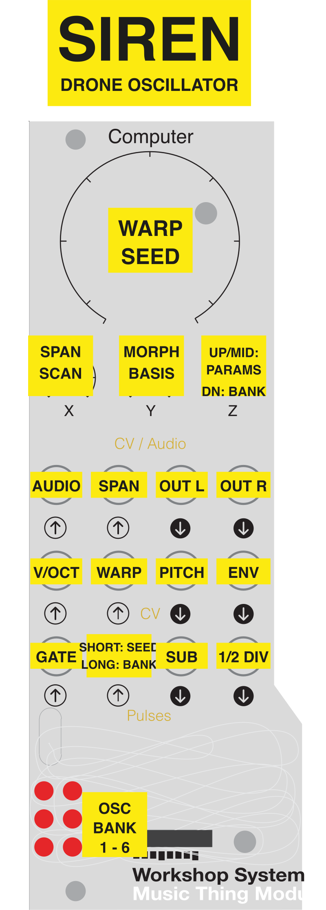

# Siren

A multi-algorithm drone oscillator for the [Music Thing Modular Workshop System Computer](https://www.musicthing.co.uk/Workshop-Computer/). Inspired by the [Forge TME Vhikk X](https://www.forge-tme.com/product/vhikk-x/)).

Siren provides 6 switchable oscillator bank algorithms, each with a distinct timbral character, all controllable via the Workshop Computer's knobs, CV inputs, and triggers. Designed to be a rich drone source within a modular system — effects processing, modulation, and filtering are left to external modules.

## Oscillator Banks

| LED | Bank | Description |
|-----|------|-------------|
| 1 | SINE | Multi-sine cluster (4 oscs). Harmonic ratios with phase feedback. Purest drone. |
| 2 | CLST | Cluster scanning (4 oscs). Tightly detuned for beating/phaser textures. |
| 3 | DTON | Diatonic (4 oscs). Just intonation intervals with wavefolding. Musical chords. |
| 4 | ANLG | Analogue (2 oscs). Cross-modulation blending into ring modulation. Classic analog character. |
| 5 | WSHP | Waveshaping (2 oscs). FM-like timbres via tanh waveshaping and wavefolding. Metallic and bright. |
| 6 | WAVE | Wavetable (4 oscs). Waveform scanning with bit reduction and cross-modulation. Complex and digital. |

## Controls



### Switch Positions

| Position | Main Knob | X Knob | Y Knob |
|----------|-----------|--------|--------|
| **Up** | WARP (cross-mod / distortion) | SPAN (frequency spread) | MORPH (waveform scan) |
| **Middle** | SEED (structural randomization) | SCAN (timbral morphing) | BASIS (root pitch) |
| **Down** | *(momentary)* Tap to cycle through oscillator banks | | |

Banks crossfade over ~84ms when switching — the current bank fades out, switches at silence, then the new bank fades in. The LEDs show the transition: the old bank dims while the new bank brightens.

### Parameters

Each parameter is interpreted differently per bank — this is core to the exploration-focused design. All 6 parameters are accessible via the 3 knobs across 2 switch positions:

- **WARP** (Up, Main knob) — Distortion / modulation intensity
- **SPAN** (Up, X knob) — Frequency spread between oscillators
- **MORPH** (Up, Y knob) — Waveform and timbral character
- **SEED** (Middle, Main knob) — Structural randomization (per-oscillator detuning via asymmetric prime-number multipliers)
- **SCAN** (Middle, X knob) — Timbral morphing
- **BASIS** (Middle, Y knob) — Root pitch / frequency (~55–440 Hz, 3 octave range, extendable with CV)

### Per-Bank Parameter Behavior

**SINE** — Harmonic ratios [1, 1.5, 2, 3]. WARP (Up, Main) adds phase feedback for subtle harmonics → complex overtones. SPAN (Up, X) scales each oscillator's deviation from fundamental (spreading, not shifting). MORPH (Up, Y) weights per-oscillator amplitudes from fundamentals → upper harmonics. SCAN (Middle, X) adds inter-oscillator ring modulation.

**CLST** — 4 tightly detuned oscillators. SPAN (Up, X) controls cluster width from unison → wide beating. WARP (Up, Main) applies sub-oscillator amplitude modulation for thickening → distortion. MORPH (Up, Y) applies per-oscillator frequency ratio offsets for different beating patterns. SCAN (Middle, X) selects per-oscillator waveform via circular scan (sine → tri → saw → sine, offset per osc).

**DTON** — Just intonation intervals. SPAN (Up, X) crossfades between tight intervals (1, 3rd, 5th, 7th) and wide intervals (2nd, 4th, 6th, octave). WARP (Up, Main) applies wavefold with smooth quadratic onset. SCAN (Middle, X) adds 2nd harmonic for richer timbre. MORPH (Up, Y) scans carrier waveform (sine → triangle → sawtooth).

**ANLG** — 2 oscillators with detuning. WARP (Up, Main) crossfades smoothly between cross-modulation (CCW) and ring modulation (CW). SPAN (Up, X) controls symmetric detuning. MORPH (Up, Y) scans waveform (sine → tri → saw). SCAN (Middle, X) scans modulator waveform.

**WSHP** — Carrier + modulator in ~fifth relationship. WARP (Up, Main) controls FM modulation index (0.5x → 6x). SPAN (Up, X) sets modulator frequency ratio. MORPH (Up, Y) scans carrier waveform. SCAN (Middle, X) controls wavefold intensity. SEED (Middle, Main) applies asymmetric detuning via prime multipliers.

**WAVE** — 4 oscillators with harmonic ratios [1, 2, 3, 5]. WARP (Up, Main) splits into bit reduction (CCW) and frequency cross-modulation (CW). SPAN (Up, X) scales detuning per harmonic number (upper partials spread more). MORPH (Up, Y) scans wavetable position via circular scan (sine → tri → saw → pulse → sine). SCAN (Middle, X) offsets wavetable position per oscillator + pulse width. SEED (Middle, Main) uses per-oscillator prime multipliers for asymmetric detuning.

### Knob Pickup

When switching between Up and Middle switch positions, knobs use "pickup" behavior (like the Arturia MicroFreak). The parameter holds its current value until the physical knob crosses near it, preventing sudden jumps.

### Jacks

| Jack | Function |
|------|----------|
| **Audio In 1** | Processor input — external audio is waveshaped/folded by WARP and SCAN, blended by MORPH, summed with drone. Mono input creates stereo output via offset processing. |
| **Audio In 2** | SPAN modulation — external CV or audio modulates detuning/spread. Patch an LFO for evolving textures or a sequencer for rhythmic spread changes. |
| **Audio Out 1** | Left audio output |
| **Audio Out 2** | Right audio output |
| **CV In 1** | Pitch modulation (added to BASIS) |
| **CV In 2** | WARP modulation |
| **CV Out 1** | Pitch CV — mirrors current pitch (BASIS + CV1 modulation), centered around 0V |
| **CV Out 2** | Envelope level — 0 when gated off, ramps up when open |
| **Pulse In 1** | Gate — drone on/off |
| **Pulse In 2** | Dual-purpose: short pulse randomizes SEED, long hold (≥500ms) cycles bank with crossfade |
| **Pulse Out 1** | Sub-oscillator clock — square wave at the fundamental frequency |
| **Pulse Out 2** | 1/2 divider — square wave one octave below the fundamental |


When no gate is patched to Pulse In 1, the drone runs continuously. To use as a pure audio processor, gate the drone off via Pulse In 1 and patch audio into Audio In 1.

## Building

Requires the [Raspberry Pi Pico SDK](https://github.com/raspberrypi/pico-sdk).

```bash
mkdir build && cd build
cmake ..
make
```

Flash the resulting `siren.uf2` to the Workshop Computer by holding BOOT while connecting USB, then dragging the file to the mounted drive.

## Technical Details

- All DSP uses fixed-point integer arithmetic (Q15 audio, Q16.16 phase accumulators)
- Waveforms generated from 1024-point lookup tables with linear interpolation
- Nonlinearities (tanh, wavefold) via lookup tables
- Only one oscillator bank computes each sample (crossfade uses fade-out → switch → fade-in to stay within CPU budget)
- Knob pickup prevents parameter jumps when switching pages
- Estimated CPU usage: ~20-40% of budget per sample at 48 kHz
- No dynamic memory allocation

## Videos

- [Overview of oscillator banks](https://youtu.be/DORHEYpUqWU)
- [Short jam](https://youtu.be/Lqdvu03-Lqs)

## Origins

The oscillator algorithms are inspired by the Forge TME Vhikk X Eurorack module's SEED/SCAN paradigm of structural vs. timbral randomization.

## License

MIT
